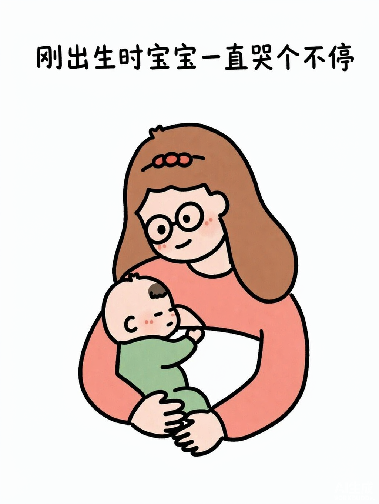

# storycard-parent-child

**简洁手绘亲子故事卡** —— 白底 + 均匀细黑描边 + 纯平涂色块的极简亲子插画，适合微信公众号与小红书内容图文。

一眼看上去像家长用马克笔在白纸上画完、上色后随手拍下的故事卡。



## 这个风格的辨识度在哪

全在**「描边均匀、色块纯净」**上：

- 均匀细至中等黑色描边，线宽基本一致、圆润闭合
- **纯平涂色块** —— 色块内部零笔触、零纹理、零留白孔洞
- 圆润扁平造型，小实心黑点眼，珊瑚粉圆腮红
- 纯白平面底 + 顶部一行手写中文标题

> ⚠️ **最容易翻车的地方**：模型看到「手绘」就会自动加蜡笔笔触纹理。
> 本风格与 `hand-drawn-styles` 库的 3.1 蜡笔童涂**正好相反** —— 3.1 要乱涂留白，本风格要纯净平涂。
> 生图时 prompt 里「填色（硬性）」那一段不能省。

## 平台规格

| 平台 | 比例 | 像素 |
|---|---|---|
| 公众号配图 / 小红书竖图（默认） | **3:4** | **1080×1440** |
| 公众号封面（不推荐） | 2.35:1 | 极窄横条会裁主体 |

## 安装

```bash
git clone https://github.com/hzui/storycard-parent-child.git
cp -r storycard-parent-child ~/.workbuddy/skills/
```

- **Windows（Git Bash）**：`~/.workbuddy/skills/` 通常解析到 `C:\Users\<用户名>\.workbuddy\skills\`
- **macOS / Linux**：同上，`~` 即家目录

装完在 WorkBuddy 里说「用故事卡 skill 做亲子配图」即可触发。

**更新**（已安装过的）：

```bash
cd ~/.workbuddy/skills/storycard-parent-child
git pull
```

⚠️ 若你本地改过 `assets/anchor-storycard.png`，`git pull` 会冲突。
建议先备份再pull，或用 `git stash`。

## 用法

| 要素 | 说明 |
|---|---|
| 触发词 | 故事卡 / 亲子故事卡 / 简洁手绘亲子图 / 公众号配图 / 小红书配图 / 母婴图文 |
| 主体 | 只写人物、动作、关系、必要道具，**不要混入画风词** |
| 主色调 | 从色板点 3–5 个，如「奶白、珊瑚粉、橙棕、草绿、蜜桃肤色」 |
| 标题 | 准确原文，**建议 ≤ 14 字**（超出会挤） |

生图参数：**传 `assets/anchor-storycard.png` 作 image1 + `input_fidelity=high`**，size `1080×1440`，quality `high`。一次生成即可，不需要多阶段修正。

## 九条命门

1. 纯白平面底，无纸纹摄影 / 褶皱 / 投影 / 做旧
2. 均匀细至中等黑规整描边（非蜡笔线、非马克笔、非潦草线）
3. 圆润扁平造型，禁 Q 版大头、3D 立体、解剖塑形
4. **纯平涂色块（硬性）** —— 零笔触、零纹理、零留白孔洞
5. 脸部极简：小实心黑点眼，无眼白虹膜高光，基本无眉，短弧嘴
6. 珊瑚粉圆腮红 —— 面部唯一彩色点缀
7. 有限 4–6 色柔和婴儿色系，禁荧光色与灰雾滤镜
8. 顶部手写中文标题，除此之外画面无任何文字 / 水印 / logo
9. 禁商业精修：无渐变、高光、阴影、材质、复杂细节

## 与近似画风的区别

本风格**不属于 `hand-drawn-styles` 库的任何一套**。常见误判：

| 画风 | 关键区别 |
|---|---|
| 3.1 蜡笔童涂 | 歪扭抖线 + 蜡笔乱涂 + 大片漏白（**与本风格相反**） |
| 17 墨线绘本 | 大虹膜显眼 + 半身胸像 + 水彩背景框 + 禁粗描边 |
| 18 暖色扁平绘本 | 几乎无外轮廓线 + 几何大色块 |
| 20 暖黄墨线 | 芥末黄限色四色 + 干墨线 + 禁蓝绿 |
| 14 北欧绘本水粉 | 全画纸纹 + navy 点眼 + 零投影 |

**归类铁律**：只能用**形式特征**（线条 / 填色 / 造型 / 脸部 / 版式）判断画风，**绝不能用题材**。
比对时优先比对配方的**禁止项**。

## 像素自检

分类统计「白底 / 黑线 / 平涂色块」占比，与锚点对照：

| 指标 | 合格区间 |
|---|---|
| 黑线 | **6% – 8%**（< 4% 说明描边太弱） |
| 平涂色块 | 14% – 22% |
| 白底 | 70% – 80% |

若色块出现明显笔触纹理，说明平涂失败，重出。

## 已知坑位

| 坑 | 症状 | 修法 |
|---|---|---|
| 自动加笔触纹理 | 色块出现蜡笔质感 | 保留「填色（硬性）」整段 + 「零纹理、零留白孔洞」 |
| 描边变细变弱 | 整体像线稿 | 强调「均匀的细至中等黑色线条、线宽基本一致」 |
| 主体撑满画框 | 顶部没地方写标题 | 强调「主体顶边不高于画面 40%、上方大片留白」 |
| 脸变精致 | 出现大眼白 / 高光 / 眉 | 脸部段整段不能省，逐条列禁止项 |
| 中文糊或错字 | 标题不可读 | 缩短标题；或无字出图 + Pillow 后期贴字 |
| 配色超载 | 一堆颜色 | 点名 3–5 色并写「约 5 种颜色」 |
| 模型加装饰 | 出现小动物 / 花朵 / 星星 | 强调「最多一件必要道具，不要装饰性小物」 |

## 配套

- 公众号正文排版 → `ghost-to-wechat`
- 公众号贴图（文字海报）→ `wechat-poster`
- 公众号封面 → `gbro-cover-design`

## 版权说明

本仓库**不含**风格来源的原始参考图（版权归属不明，未随仓库分发）。
`assets/anchor-storycard.png` 为本项目独立生成的主视觉锚点，可自由使用。
若你是从某张参考图反向构建了类似 skill，请同样不要分发原图。

## License

MIT
